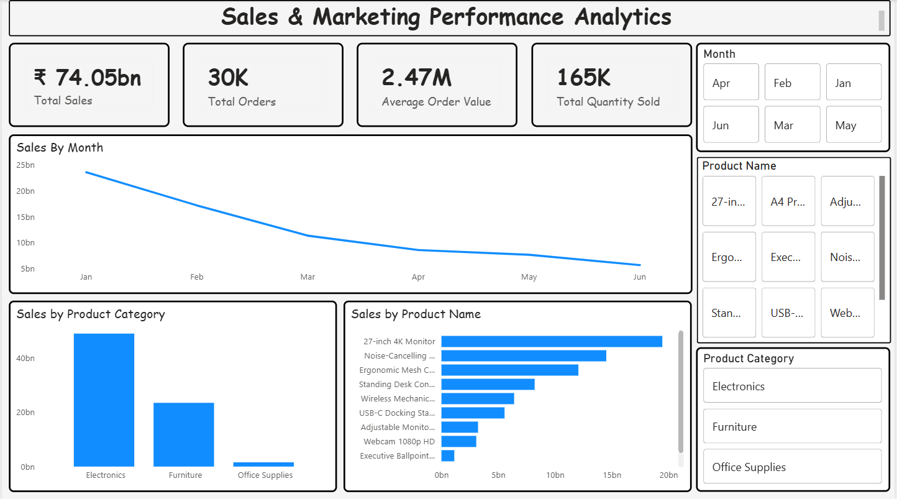

# Sales & Marketing Performance Analytics Dashboard

## Project Overview
This project visualizes sales and marketing performance using Power BI. It provides interactive insights into sales trends, product performance, and overall business KPIs.

## Tools Used
- Power BI for building interactive dashboards and visualizations

## Dataset
Columns: Transaction ID, Date, Product ID, Product Name, Product Category, Quantity, PPU, Amount, Month

## Dashboard Features
KPI Cards:
- Total Sales
- Total Orders
- Average Order Value
- Total Quantity Sold

Charts:
- Sales Trend (Line Chart)
- Sales by Product Category (Column Chart)
- Top Products by Sales (Bar Chart)

## Visualization

## Key Insights
- Identified top-performing products and categories
- Analyzed monthly sales trends
- Built an interactive dashboard for business decision-making
